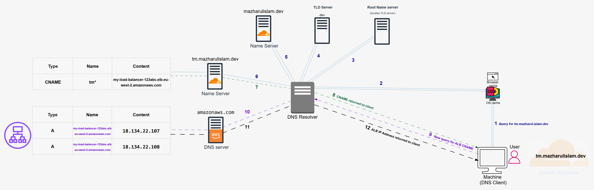

<a id="docs-top"></a>

# Intro

This is documentation for the ECS-Forge repo - it contains docs related to all the code set up for this project.

## Table of Contents

- [Intro](#intro)
  - [Table of Contents](#table-of-contents)
- [Traffic Flow Explained](#traffic-flow-explained)
  - [Access to website](#access-to-website)
- [Load Balancer and remaining](#load-balancer-and-remaining)
- [Technology Stack Explained](#technology-stack-explained)
  - [Infrastructure as Code Tools](#infrastructure-as-code-tools)
  - [Terraform](#terraform)
  - [Terragrunt](#terragrunt)
  - [AWS Services Used](#aws-services-used)
- [Project Structure](#project-structure)
  - [Overview](#overview)
  - [Structure Explained](#structure-explained)
    - [Dockerfile, LICENSE, README.md, and App](#dockerfile-license-readmemd-and-app)
    - [Architecture - decisions.md file and Documentation - README.md file](#architecture---decisionsmd-file-and-documentation---readmemd-file)
    - [Infrastructure directory](#infrastructure-directory)
      - [Backend, provider.tf files](#backend-providertf-files)
      - [Infrastructure - live directory](#infrastructure---live-directory)
      - [Infrastructure - modules directory](#infrastructure---modules-directory)
- [DEEP DIVE](#deep-dive)
  - [Root Configuration (terragrunt.hcl)](#root-configuration-terragrunthcl)
    - [File Location](#file-location)
    - [Locals Block](#locals-block)
    - [Remote State Block](#remote-state-block)
    - [Generate Provider Block](#generate-provider-block)
  - [Terraform Modules](#terraform-modules)
    - [VPC Module](#vpc-module)
      - [Resources](#resources)
      - [Inputs](#inputs)
      - [Outputs](#outputs)
      - [Code](#code)
      - [aws\_availability\_zones data block](#aws_availability_zones-data-block)
      - [VPC resource block](#vpc-resource-block)
      - [Public Subnet resource block](#public-subnet-resource-block)
      - [Internet Gateway resource block](#internet-gateway-resource-block)
      - [Public Route Table resource block](#public-route-table-resource-block)
      - [Public Route Table Association resource block](#public-route-table-association-resource-block)
      - [Private Subnets resource block](#private-subnets-resource-block)
      - [Private Route Table resource block](#private-route-table-resource-block)
      - [Private Route Tables Association resource block](#private-route-tables-association-resource-block)
    - [Security Groups Module](#security-groups-module)
      - [Resources](#resources-1)
      - [Inputs](#inputs-1)
      - [Outputs](#outputs-1)
    - [VPC Endpoints Module](#vpc-endpoints-module)
      - [Resources](#resources-2)
      - [Inputs](#inputs-2)
      - [Outputs](#outputs-2)
    - [AWS Certificate Manager (ACM) Module](#aws-certificate-manager-acm-module)
      - [Resources](#resources-3)
      - [Inputs](#inputs-3)
      - [Outputs](#outputs-3)
    - [ALB (Application Load Balancer) Module](#alb-application-load-balancer-module)
      - [Resources](#resources-4)
      - [Inputs](#inputs-4)
      - [Outputs](#outputs-4)
    - [DNS Module](#dns-module)
      - [Resources](#resources-5)
      - [Inputs](#inputs-5)
      - [Outputs](#outputs-5)
    - [ECS Module](#ecs-module)
      - [Resources](#resources-6)
      - [Inputs](#inputs-6)
      - [Outputs](#outputs-6)
    - [ECR Module](#ecr-module)
      - [Resources](#resources-7)
      - [Inputs](#inputs-7)
      - [Outputs](#outputs-7)
    - [OIDC Module](#oidc-module)
      - [Resources](#resources-8)
      - [Inputs](#inputs-8)
      - [Outputs](#outputs-8)
  - [Live Environment Configurations](#live-environment-configurations)
  - [CI/CD Pipelines (GitHub Actions)](#cicd-pipelines-github-actions)
  - [Dockerfile Explained](#dockerfile-explained)
  - [Bootstrap Script](#bootstrap-script)
  - [Supporting Configuration Files	37](#supporting-configuration-files37)
  - [Glossary of Terms](#glossary-of-terms)

<p align="right">(<a href="#docs-top">back to top</a>)</p>

# Traffic Flow Explained

## Access to website


To access the live application in production environment, the user types in ***tm.mazharulislam.dev***(or ***tm-dev.mazharulislam.dev*** if accessing development environment).

A DNS (Domain Name System) query takes place - the client sends out tm.mazharulislam.dev and receives the IP address of the public-facing Application Load Balancer (ALB) allowing it to connect to the application hosted in AWS.




Assuming there is no cache stored at any stage - [the following](https://www.cloudflare.com/en-gb/learning/dns/what-is-dns/) will happen:

1. User types in "tm.mazharulislam.dev" - the client checks locally to see if the IP address is cached - within it's browser, or the OS

2. The query travels into the Internet and is received by a DNS resolver

3. The root server responds with the address of a Top Level Domain (TLD) DNS server .dev

4. The resolver then makes a request to the TLD server carrying .dev domain which responds with the IP address of the domain’s nameserver mazharulislam.dev

5. The resolver sends a query to the domain’s nameserver - since a subdomain **tm** is present there is an [additional nameserver](https://www.cloudflare.com/en-gb/learning/dns/what-is-dns/) which holds the CNAME record

6. The [CNAME](https://developers.cloudflare.com/dns/manage-dns-records/reference/dns-record-types/) is mapped to the Application Load Balancer (ALB) DNS name which is returned to the resolver from the nameserver

7. The authoritative name server responds to the DNS resolver with the CNAME record which includes the DNS name of the load balancer*

8. This record is forwarded to the client

9. Client makes a new query for the ALB CNAME

10. The resolver forwards to amazonaws.com domain where the A record is hosted

11. A record containing the [IP addresses of the ALB nodes](https://docs.aws.amazon.com/elasticloadbalancing/latest/application/application-load-balancers.html) is returned to DNS resolver

12. DNS resolver finally returns the IP address of the ALB, allowing the client to send a HTTP request in order to connect to the code-server application


*If the apex zone mazharulislam.dev was used instead (by replacing **tm** with **@**), Cloudflare can return the ALB IP address via a process called [CNAME flattening](https://developers.cloudflare.com/dns/cname-flattening/)(see also [Flattening diagram](https://developers.cloudflare.com/dns/cname-flattening/cname-flattening-diagram/))

<p align="right">(<a href="#docs-top">back to top</a>)</p>

# Load Balancer and remaining

Use this section to explain flow from ALB to tasks in private subnet

Also explain how applications can access AWS services privately


# Technology Stack Explained

## Infrastructure as Code Tools

## Terraform

## Terragrunt

## AWS Services Used

<p align="right">(<a href="#docs-top">back to top</a>)</p>

# Project Structure

## Overview

```
.
├── Dockerfile
├── LICENSE
├── README.md
├── app
├── architecture
│   └── decisions.md
├── documentation
│   └── README.md
├── infrastructure
│   ├── backend.tf
│   ├── bootstrap
│   │   ├── ReadMe.md
│   │   ├── bootstrap.sh
│   │   └── destroy.sh
│   ├── live
│   │   ├── _env
│   │   │   └── common.hcl
│   │   ├── dev
│   │   │   ├── acm
│   │   │   │   └── terragrunt.hcl
│   │   │   ├── alb
│   │   │   │   └── terragrunt.hcl
│   │   │   ├── dns
│   │   │   │   └── terragrunt.hcl
│   │   │   ├── ecs
│   │   │   │   └── terragrunt.hcl
│   │   │   ├── env.hcl
│   │   │   ├── security-groups
│   │   │   │   └── terragrunt.hcl
│   │   │   ├── vpc
│   │   │   │   └── terragrunt.hcl
│   │   │   └── vpc-endpoints
│   │   │       └── terragrunt.hcl
│   │   ├── global
│   │   │   ├── ecr
│   │   │   │   └── terragrunt.hcl
│   │   │   └── oidc
│   │   │       └── terragrunt.hcl
│   │   └── prod
│   │       ├── acm
│   │       │   └── terragrunt.hcl
│   │       ├── alb
│   │       │   └── terragrunt.hcl
│   │       ├── dns
│   │       │   └── terragrunt.hcl
│   │       ├── ecs
│   │       │   └── terragrunt.hcl
│   │       ├── env.hcl
│   │       ├── security-groups
│   │       │   └── terragrunt.hcl
│   │       ├── vpc
│   │       │   └── terragrunt.hcl
│   │       └── vpc-endpoints
│   │           └── terragrunt.hcl
│   ├── modules
│   │   ├── acm
│   │   │   ├── main.tf
│   │   │   ├── outputs.tf
│   │   │   └── variables.tf
│   │   ├── alb
│   │   │   ├── main.tf
│   │   │   ├── outputs.tf
│   │   │   └── variables.tf
│   │   ├── dns
│   │   │   ├── main.tf
│   │   │   ├── outputs.tf
│   │   │   └── variables.tf
│   │   ├── ecr
│   │   │   ├── main.tf
│   │   │   ├── outputs.tf
│   │   │   └── variables.tf
│   │   ├── ecs
│   │   │   ├── main.tf
│   │   │   ├── outputs.tf
│   │   │   └── variables.tf
│   │   ├── oidc
│   │   │   ├── main.tf
│   │   │   ├── outputs.tf
│   │   │   └── variables.tf
│   │   ├── security-groups
│   │   │   ├── main.tf
│   │   │   ├── outputs.tf
│   │   │   └── variables.tf
│   │   ├── vpc
│   │   │   ├── main.tf
│   │   │   ├── outputs.tf
│   │   │   └── variables.tf
│   │   └── vpc-endpoints
│   │       ├── main.tf
│   │       ├── outputs.tf
│   │       └── variables.tf
│   ├── provider.tf
│   └── terragrunt.hcl
└── other
    ├── both.tf
    ├── createpolicy.tf
    └── deletepolicy.tf
```
<p align="right">(<a href="#docs-top">back to top</a>)</p>

## Structure Explained

### Dockerfile, LICENSE, README.md, and App

```
├── Dockerfile
├── LICENSE
├── README.md
├── app
```

According to [Docker docs](https://docs.docker.com/reference/dockerfile/) the Dockerfile is a text file that contains all the commands that a user would run on a command line that tells Docker to build the image.

The ReadME.md file is for any person visiting the repo to understand at a high level what the project does and how they can set this up for themselves.

The LICENSE.txt file specifies how the repo can be distributed and used.

The app directory contains the application itself - though it is not used in the Dockerfile (due to issues with git submodules not pulling the application properly)

### Architecture - decisions.md file and Documentation - README.md file

```
├── architecture
│   └── decisions.md
├── documentation
│   └── README.md
```

The decisions.md file in the architecture directory outline the key architectural decisions made in the project. This file communicates IMPACT as opposed to details in the next file.

The README.md file (this file) in the documentation directory is documentation for the ECS-Forge repo - it contains docs related to all the code set up for this project.

### Infrastructure directory

```
└── infrastructure
    ├── backend.tf
    ├── bootstrap
    ├── live
    ├── modules
    ├── provider.tf
    └── terragrunt.hcl
```
This directory contains EVERYTHING related to the infrastructure required to deploy the application.

#### Backend, provider.tf files
```
└── infrastructure
    ├── backend.tf
    .
    .
    .
    ├── provider.tf
```

Terragrunt automatically generates these files in order to tell terraform where the S3 bucket is stored and which providers to use respectively. They are generated every run and can be safely deleted.

<p align="right">(<a href="#docs-top">back to top</a>)</p>

#### Infrastructure - live directory

```
│   ├── live
│   │   ├── _env
│   │   │   └── common.hcl
│   │   ├── dev
│   │   │   ├── acm
│   │   │   │   └── terragrunt.hcl
│   │   │   ├── alb
│   │   │   │   └── terragrunt.hcl
│   │   │   ├── dns
│   │   │   │   └── terragrunt.hcl
│   │   │   ├── ecs
│   │   │   │   └── terragrunt.hcl
│   │   │   ├── env.hcl
│   │   │   ├── security-groups
│   │   │   │   └── terragrunt.hcl
│   │   │   ├── vpc
│   │   │   │   └── terragrunt.hcl
│   │   │   └── vpc-endpoints
│   │   │       └── terragrunt.hcl
│   │   ├── global
│   │   │   ├── ecr
│   │   │   │   └── terragrunt.hcl
│   │   │   └── oidc
│   │   │       └── terragrunt.hcl
│   │   └── prod
│   │       ├── acm
│   │       │   └── terragrunt.hcl
│   │       ├── alb
│   │       │   └── terragrunt.hcl
│   │       ├── dns
│   │       │   └── terragrunt.hcl
│   │       ├── ecs
│   │       │   └── terragrunt.hcl
│   │       ├── env.hcl
│   │       ├── security-groups
│   │       │   └── terragrunt.hcl
│   │       ├── vpc
│   │       │   └── terragrunt.hcl
│   │       └── vpc-endpoints
│   │           └── terragrunt.hcl
```

This directory contains the live Terragrunt configuration of the:

- global infra: Modules that bootstrap the dev and prod environments
- dev infra: Modules for development enviromnent
- prod infra: Modules for production environment
- common.hcl: This a file containing common values between the above directories

These directories contain further directories representing [single instances of infrastructure](https://docs.terragrunt.com/getting-started/terminology#unit) managed by Terragrunt - represented by the presence of terragrunt.hcl files which define the [Terragrunt configuration](https://docs.terragrunt.com/reference/hcl/)

This the HOW and WHERE - which environment, values, and where to store state.

#### Infrastructure - modules directory

```
│   ├── infrastructure
    │   .
    │   .
    │   .
    │   ├── modules
    │   │   ├── acm
    │   │   │   ├── main.tf
    │   │   │   ├── outputs.tf
    │   │   │   └── variables.tf
    │   │   ├── alb
    │   │   │   ├── main.tf
    │   │   │   ├── outputs.tf
    │   │   │   └── variables.tf
    │   │   ├── dns
    │   │   │   ├── main.tf
    │   │   │   ├── outputs.tf
    │   │   │   └── variables.tf
    │   │   ├── ecr
    │   │   │   ├── main.tf
    │   │   │   ├── outputs.tf
    │   │   │   └── variables.tf
    │   │   ├── ecs
    │   │   │   ├── main.tf
    │   │   │   ├── outputs.tf
    │   │   │   └── variables.tf
    │   │   ├── oidc
    │   │   │   ├── main.tf
    │   │   │   ├── outputs.tf
    │   │   │   └── variables.tf
    │   │   ├── security-groups
    │   │   │   ├── main.tf
    │   │   │   ├── outputs.tf
    │   │   │   └── variables.tf
    │   │   ├── vpc
    │   │   │   ├── main.tf
    │   │   │   ├── outputs.tf
    │   │   │   └── variables.tf
    │   │   └── vpc-endpoints
    │   │       ├── main.tf
    │   │       ├── outputs.tf
    │   │       └── variables.tf
```

This contains the reusable terraform modules required for deploying infrastructure. The units call the variables at runtime. This is the WHAT - the actual AWS resources.

<p align="right">(<a href="#docs-top">back to top</a>)</p>

# DEEP DIVE
## Root Configuration (terragrunt.hcl)

### File Location

```
└── infrastructure
    ├── backend.tf
    ├── bootstrap
    .
    .
    .
    └── terragrunt.hcl
```
This file is located within the root of my infrastructure directory (directly inside it - not any further in). This is because it holds configuration common to ALL modules.

### Locals Block

```
locals {
  project_name = "ecs-project"
  aws_region   = "eu-west-2"
  domain_name  = "mazharulislam.dev"
  account_id   = get_aws_account_id()
  bucket_name  = "${local.project_name}-terraform-state-${local.account_id}-${local.aws_region}"
  environment = element(split("/", path_relative_to_include()), 1)
}
```

This block defines values that will be used [elsewhere in the configuration](https://docs.terragrunt.com/reference/hcl/blocks/#locals). These are values are REFERENCED by Terragrunt in almost every single unit that is run.

When they call terraform modules, they POPULATE the empty values set for variables (variables.tf).

The block includes:

`project name` and `aws region` - these are referenced by terraform in ALL modules for resource-level tags

`domain_name` - the apex domain which dev (tm-dev) and prod (tm) environments are based on

`account_id` - the ACTIVE AWS account id at runtime, logged in either via AWS CLI (locally) or within AWS configure-aws-credentials action within CD (Github Actions runner)

`bucket_name` - The name of the S3 bucket - this is a combination of locals from earlier to make it globally unique*

`environment` - This is a dynamic local which outputs the environment of the child terragrunt.hcl calling it - a demo is below:
<br><br>
>The `environment = element(split("/", path_relative_to_include()), 1)` has both Terragrunt and HCl functions within which grab the environment based on the directory structure below:
>
>`path_relative_to_include()` [returns the relative path](https://docs.terragrunt.com/reference/hcl/functions/#path_relative_to_include) between the child terragrunt.hcl and the parent terragrunt.hcl at root
>
>For example if child is at `live/dev/vpc/terragrunt.hcl` - and since parent is at repo root, this returns `live/dev/vpc`
>
>This is wrapped in `split()` - a HCL function [which produces a list](https://developer.hashicorp.com/packer/docs/templates/hcl_templates/functions/string/split) based on the `/` seperator - returns `["live", "dev", "vpc"]`
>
>The final function `element()` [retrieves a single element from a list](https://developer.hashicorp.com/terraform/language/functions/element) - since the index is zero based, and based on the folder config, the environment is found in index `1` - this returns the string `"dev"`.

<br>

>*IMPROVEMENT 03/04: Improve bucket naming convention - S3 now accepts [account regional namespaces](https://aws.amazon.com/blogs/aws/introducing-account-regional-namespaces-for-amazon-s3-general-purpose-buckets/) for s3 buckets, which means automatically provides an `account_id` and `aws_region` suffix linked to the account creating this - it means:
>
>A: I do not have to manually append the two locals here>
>
>B: IMPORTANTLY means if another account tries to create buckets using this suffix [their request is rejected - preventing bucket takeover attacks!](https://aws.amazon.com/blogs/aws/introducing-account-regional-namespaces-for-amazon-s3-general-purpose-buckets/)

<p align="right">(<a href="#docs-top">back to top</a>)</p>

### Remote State Block

```
remote_state {
  backend = "s3"
  
  generate = {
    path      = "backend.tf"
    if_exists = "overwrite_terragrunt"
  }
  
  config = {
    bucket       = local.bucket_name
    key          = "${path_relative_to_include()}/terraform.tfstate"
    region       = local.aws_region
    encrypt      = true
    use_lockfile = true
  }
}
```

This block is used to [configure the remote state configuration](https://docs.terragrunt.com/reference/hcl/blocks/#remote_state) for terraform.

With `backend = s3` - the backend is defined as Amazon Web Service's (AWS) Simple Storage Solution (S3) - this is highly available cloud storage which provides remote storage for the terraform state. Contrasting to storing locally this is much more reliable since AWS manages this specifically and [provides 99.99% availability](https://docs.aws.amazon.com/AmazonS3/latest/userguide/DataDurability.html) for objects stored in it over a year.

The `generate` block requests terragrunt to [generate a `backend.tf` in the working directory](https://oneuptime.com/blog/post/2026-02-23-how-to-use-the-generate-block-in-terragrunt/view#what-the-generate-block-does) with the specified configuration.

`path = "backend.tf"` provides the path where the backend.tf file is generated - set to the same directory as this file.

`if_exists = "overwrite_terragrunt"` tells Terragrunt to overwrite the TERRAGRUNT GENERATED backend.tf file if it already exists. This is specificied to prevent overwriting a human-written backend.tf file if that was created.

`config` is a map that configures the state with:

- `bucket       = local.bucket_name` this is the local value defined earlier in `locals` block
- `key          = "${path_relative_to_include()}/terraform.tfstate"` uses the earlier `path_relative_to_include` function to ensure each child terragrunt.hcl file [has a remote state at a different key](https://docs.terragrunt.com/reference/hcl/functions/#path_relative_to_include)
- `encrypt      = true` [enables server-side encryption](https://docs.terragrunt.com/reference/hcl/blocks/#terraform) of the state file
- `use_lockfile = true`[enables native s3 state locking](https://docs.terragrunt.com/reference/hcl/blocks/#backend)

<br>

>AD: Remote S3 backend
>
>AD: S3 Server-side encryption
>
>AD: S3 native state-locking
>
>IMPROVEMENT 03/04: Consider using remote state bootstrap offered by Terragrunt https://docs.terragrunt.com/features/units/state-backend/)

### Generate Provider Block

```
generate "provider" {
  path      = "provider.tf"
  if_exists = "overwrite_terragrunt"
  
  contents = <<EOF
terraform {
  required_version = "~> 1.14" # Allows 1.14.0, 1.14.1 etc. but not 1.15 - no major/minor suprises
  required_providers {
    aws = {
      source  = "hashicorp/aws"
      version = "~> 6.0"
    }
    cloudflare = {
  source  = "cloudflare/cloudflare"
  version = "~> 5.0"
    }
  }
}

provider "aws" {
  region = "${local.aws_region}"

  default_tags {
    tags = {
    Project     = "${local.project_name}"
    Environment = "${local.environment}"
    ManagedBy   = "Terragrunt"
    Repository  = "github.com/Mazharul419/ecs_full"
    }
  }
}

provider "cloudflare" {
  api_token = var.cloudflare_api_token
}

variable "cloudflare_api_token" {
  type      = string
  sensitive = true
}

EOF
}
```

This block is used to define the `required_providers` and `provider` configuration for each child terragrunt.hcl file.

A provider is [a Terraform plugin](https://developer.hashicorp.com/terraform/language/block/provider). It helps Terraform manage real-world infrastructure with their own resources and data sources.

```
generate "provider" {
  path      = "provider.tf"
  if_exists = "overwrite_terragrunt"


  contents = <<EOF
.
.
.
EOF
}
```

The `generate` block requests terragrunt to [generate a `provider.tf` in the working directory](https://oneuptime.com/blog/post/2026-02-23-how-to-use-the-generate-block-in-terragrunt/view#what-the-generate-block-does) with the specified configuration. It is named `"provider"` for Terragrunt's reference.

`path = "provider.tf"` provides the path where the backend.tf file is generated - set to the same directory as this file.

`if_exists = "overwrite_terragrunt"` tells Terragrunt to overwrite the TERRAGRUNT GENERATED provider.tf file if it already exists. This is specificied to prevent overwriting a human-written provider.tf file if that was created.

```
  contents = <<EOF
.
.
.
EOF
```

This is a "heredoc" style string literal supported by Terraform which [contains multi-lines string literals](https://developer.hashicorp.com/terraform/language/expressions/strings#heredoc-strings) - in this context it allows specifying the generated file content.

<p align="right">(<a href="#docs-top">back to top</a>)</p>

```
terraform {
  required_version = "~> 1.14" # Allows 1.14.0, 1.14.1 etc. but not 1.15 - no major/minor suprises
  required_providers {
    aws = {
      source  = "hashicorp/aws"
      version = "~> 6.0"
    }
    cloudflare = {
  source  = "cloudflare/cloudflare"
  version = "~> 5.0"
    }
  }
}
```
The `terraform{}` block [defines how terraform behaves](https://developer.hashicorp.com/terraform/language/block/terraform#terraform-block)

`required version` - [specifies which version of Terraform CLI](https://developer.hashicorp.com/terraform/language/block/terraform#required_version) is allowed to run the configuration - set to 1.14, but allows 1.14.0, 1.14.1 but not minor (1.15, 1.16) or major bumps (2.0.0, 3.0.0) in version

1.14.8 as of writing (03/04/2026) is the latest version

`required providers` - [specifies provider plugins required](https://developer.hashicorp.com/terraform/language/block/terraform#required_providers) to create and manage their respective resources 

`aws` and `cloudflare` are defined as part of this with their respective sources and versions - with the same increments of versions acceptable as terraform.

Latest versions as of writing:

`aws` : 6.39.0
`cloudflare` : 5.19.0-beta.4

> You can find the latest versions and commands to use their configuration on [Hashicorps Official website](https://registry.terraform.io/browse/providers)

```
provider "aws" {
  region = "${local.aws_region}"

.
.
.

}
```

The `provider` block [declares and configures](https://developer.hashicorp.com/terraform/language/block/provider?page=providers&page=configuration) the providers that terraform uses.

Here the `region` is specified as the earlier defined locals value - which [defines the region](https://developer.hashicorp.com/terraform/tutorials/aws-get-started/aws-create#providers) the aws resources are created in when communicating with the API.

Here I decided to use eu-west-2 (London) - admittedly, the only reason was that it is the closest from me. I am certain there are better reasons for region choice when deploying which I'd like to pick up on.

> IMPROVEMENT 09/04: Have better justification for region selection i.e., is it faster? More secure? etc.

> Good Practice:
> 
> Even though this is already defined in my `~/.aws/config` - it is better to explicitly define this in the terraform configuration since:
> 
> A: It is explicit to anyone viewing the code - and not hidden behind a config file locally
> 
> B: It [has the highest precedence in configuration order](https://registry.terraform.io/providers/hashicorp/aws/latest/docs#authentication-and-configuration) - therefore cannot be overriden.

The `default_tags` block [provides default tags](https://registry.terraform.io/providers/hashicorp/aws/latest/docs#default_tags-configuration-block) to all resources within this provider.

> In order for terraform to deploy resource to AWS - it needs to [communicate programmatically](https://developer.hashicorp.com/terraform/tutorials/aws-get-started/aws-create#providers). It [communicates to the endpoint](https://docs.aws.amazon.com/general/latest/gr/rande.html) of the AWS web service - this is per service per region - in the following format:
> `protocol://service-code.region-code.amazonaws.com`
>
> i.e., `https://dynamodb.us-west-2.amazonaws.com` is the endpoint for the Amazon DynamoDB service in the US West (Oregon) Region

Since terraform uses the same method to authenticate as the AWS Command-Line-Interface (CLI) (Same reference as above) - I used my already logged in long-term credentials [NOT RECOMMENDED*] to authenticate locally. [Here](https://docs.aws.amazon.com/cli/v1/userguide/cli-chap-authentication.html) is documentation showing different ways to authenticate.

Here, IAM user short-term credentials is best, since if they are compromised, there is a limited time they can be used for.

My AWS account with root user created a seperate CLI user account via Identity Access Management (IAM) service with a Administrator Access policy (Full guide [here](https://docs.aws.amazon.com/cli/v1/userguide/cli-authentication-user.html)). This policy allows ALL actions on ALL resources.

>*IMPROVEMENT: 07/04: Use short-term IAM credentials to limit blast radius if compromised.
>
>*IMPROVEMENT: 07/04: Even if using long-term credentials, [ROTATE them regularly](https://aws.amazon.com/blogs/security/how-to-rotate-access-keys-for-iam-users/)

```
  default_tags {
    tags = {
    Project     = "${local.project_name}"
    Environment = "${local.environment}"
    ManagedBy   = "Terragrunt"
    Repository  = "github.com/Mazharul419/ecs_full"
    }
  }
```
Within the provider as a whole - `default_tags` [applies default tags to resources that ARE NOT DIRECTLY MANAGED](https://registry.terraform.io/providers/hashicorp/aws/latest/docs/data-sources/default_tags) by a Terraform resource.

> AD: Provider-level Resource tagging - this tagging enables clear ownership of resources based on project, environments, tech stack and the github repo associated with this - this in turn betters FinOps by showing clear breakdown of costs and helps identify what resources are associated with this project.

<p align="right">(<a href="#docs-top">back to top</a>)</p>

## Terraform Modules
### VPC Module

This module defines the Virtual Private Cloud (VPC) resource in AWS:

#### Resources

| Name | Type |
| ---- | ---- |
| [aws_internet_gateway.main](https://registry.terraform.io/providers/hashicorp/aws/latest/docs/resources/internet_gateway) | resource |
| [aws_route_table.private](https://registry.terraform.io/providers/hashicorp/aws/latest/docs/resources/route_table) | resource |
| [aws_route_table.public](https://registry.terraform.io/providers/hashicorp/aws/latest/docs/resources/route_table) | resource |
| [aws_route_table_association.private](https://registry.terraform.io/providers/hashicorp/aws/latest/docs/resources/route_table_association) | resource |
| [aws_route_table_association.public](https://registry.terraform.io/providers/hashicorp/aws/latest/docs/resources/route_table_association) | resource |
| [aws_subnet.private](https://registry.terraform.io/providers/hashicorp/aws/latest/docs/resources/subnet) | resource |
| [aws_subnet.public](https://registry.terraform.io/providers/hashicorp/aws/latest/docs/resources/subnet) | resource |
| [aws_vpc.main](https://registry.terraform.io/providers/hashicorp/aws/latest/docs/resources/vpc) | resource |
| [aws_availability_zones.available](https://registry.terraform.io/providers/hashicorp/aws/latest/docs/data-sources/availability_zones) | data source |

#### Inputs

| Name | Description | Type | Default | Required |
| ---- | ----------- | ---- | ------- | :------: |
| <a name="input_aws_region"></a> [aws\_region](#input\_aws\_region) | AWS region | `string` | n/a | yes |
| <a name="input_az_count"></a> [az\_count](#input\_az\_count) | Number of AZs to use | `number` | `2` | no |
| <a name="input_enable_dns_hostnames"></a> [enable\_dns\_hostnames](#input\_enable\_dns\_hostnames) | Enable DNS hostnames in VPC | `bool` | `true` | no |
| <a name="input_enable_dns_support"></a> [enable\_dns\_support](#input\_enable\_dns\_support) | Enable DNS support in VPC | `bool` | `true` | no |
| <a name="input_environment"></a> [environment](#input\_environment) | Environment (dev, staging, prod) | `string` | n/a | yes |
| <a name="input_private_subnet_cidrs"></a> [private\_subnet\_cidrs](#input\_private\_subnet\_cidrs) | CIDR blocks for private subnets | `list(string)` | <pre>[<br/>  "10.0.3.0/24",<br/>  "10.0.4.0/24"<br/>]</pre> | no |
| <a name="input_project_name"></a> [project\_name](#input\_project\_name) | Name of the project | `string` | n/a | yes |
| <a name="input_public_subnet_cidrs"></a> [public\_subnet\_cidrs](#input\_public\_subnet\_cidrs) | CIDR blocks for public subnets | `list(string)` | <pre>[<br/>  "10.0.1.0/24",<br/>  "10.0.2.0/24"<br/>]</pre> | no |
| <a name="input_vpc_cidr"></a> [vpc\_cidr](#input\_vpc\_cidr) | CIDR block for VPC | `string` | `"10.0.0.0/16"` | no |

#### Outputs

| Name | Description |
| ---- | ----------- |
| <a name="output_private_route_table_ids"></a> [private\_route\_table\_ids](#output\_private\_route\_table\_ids) | n/a |
| <a name="output_private_subnet_ids"></a> [private\_subnet\_ids](#output\_private\_subnet\_ids) | n/a |
| <a name="output_public_subnet_ids"></a> [public\_subnet\_ids](#output\_public\_subnet\_ids) | n/a |
| <a name="output_vpc_cidr"></a> [vpc\_cidr](#output\_vpc\_cidr) | n/a |
| <a name="output_vpc_id"></a> [vpc\_id](#output\_vpc\_id) | n/a |


#### Code

```
data "aws_availability_zones" "available" {
  state = "available"
}

resource "aws_vpc" "main" {
  cidr_block           = var.vpc_cidr
  enable_dns_hostnames = true  # Required for VPC endpoints
  enable_dns_support   = true  # Required for VPC endpoints

  tags = {
    Name = "${var.project_name}-${var.environment}-vpc"
  }
}

resource "aws_subnet" "public" {
  count                   = length(var.public_subnet_cidrs)  # Creates 2 subnets
  vpc_id                  = aws_vpc.main.id
  cidr_block              = var.public_subnet_cidrs[count.index]
  availability_zone       = data.aws_availability_zones.available.names[count.index]
  map_public_ip_on_launch = true  # Instances get public IPs - required for ALB
    tags = {
        Name = "${var.project_name}-${var.environment}-public-subnet-${count.index + 1}"
    }
}

resource "aws_internet_gateway" "main" {
  vpc_id = aws_vpc.main.id
  tags = {
    Name = "${var.project_name}-${var.environment}-igw"
  }
}

resource "aws_route_table" "public" {
  vpc_id = aws_vpc.main.id

  route {
    cidr_block = "0.0.0.0/0"
    gateway_id = aws_internet_gateway.main.id
  }

  tags = {
    Name = "${var.project_name}-${var.environment}-public-rt"
  }
}

resource "aws_route_table_association" "public" {
  count          = length(var.public_subnet_cidrs)
  subnet_id      = aws_subnet.public[count.index].id
  route_table_id = aws_route_table.public.id
}

resource "aws_subnet" "private" {
  count             = length(var.private_subnet_cidrs)
  vpc_id            = aws_vpc.main.id
  cidr_block        = var.private_subnet_cidrs[count.index]
  availability_zone = data.aws_availability_zones.available.names[count.index]

  tags = {
    Name = "${var.project_name}-${var.environment}-private-subnet-${count.index + 1}"
  }
}

resource "aws_route_table" "private" {
  count  = length(var.private_subnet_cidrs)
  vpc_id = aws_vpc.main.id

  tags = {
    Name = "${var.project_name}-${var.environment}-private-rt-${count.index + 1}"
  }
}

resource "aws_route_table_association" "private" {
  count          = length(var.private_subnet_cidrs)
  subnet_id      = aws_subnet.private[count.index].id
  route_table_id = aws_route_table.private[count.index].id
}
```
<p align="right">(<a href="#docs-top">back to top</a>)</p>

#### aws_availability_zones data block

```
data "aws_availability_zones" "available" {
  state = "available"
}
```

This is a `data` block within terraform - it [fetches data about a resource](https://developer.hashicorp.com/terraform/language/block/data) without provisioning infrastructure. 


This block [queries the avaibility zones within AWS](https://registry.terraform.io/providers/hashicorp/aws/latest/docs/data-sources/availability_zones) that can be accessed by the AWS account within the configured region defined in the earlier provider module (the local value - `eu-west-2`).

 The `state = "available"` argument filters these by those that are in an "available" state - the default option is all the states `available`, `information`, `impaired` and `unavailable`

> AD: Dynamic Availability Zone retrieval - terraform code can be implemented with modified region/account, [making the configuration more flexible](https://developer.hashicorp.com/terraform/language/data-sources)!
>
> This pattern is present in the terraform tutorial by hashicorp, as it [specifically avoids having to hardcode AZs](https://developer.hashicorp.com/terraform/tutorials/configuration-language/data-sources) within the VPC module.


#### VPC resource block

```
resource "aws_vpc" "main" {
  cidr_block           = var.vpc_cidr
  enable_dns_hostnames = true  # Required for VPC endpoints
  enable_dns_support   = true  # Required for VPC endpoints

  tags = {
    Name = "${var.project_name}-${var.environment}-vpc"
  }
}
```

This is the Virtual Private Cloud (VPC) resource block - it provides a VPC resource.

> A VPC is a [logically isolated virtual network](https://docs.aws.amazon.com/vpc/latest/userguide/what-is-amazon-vpc.html) offered by AWS.

`cidr_block` is the Classless Inter-Domain Routing (CIDR) block for the VPC - and is made into a variable (variabilised) since this differs between environments.

> Internet Protocol Version 4 (IPv4) was used to define this block - IPv4 is a set of communication rules that [provides data exchange over the internet](https://aws.amazon.com/compare/the-difference-between-ipv4-and-ipv6/)
> 
> Improvement: Given the expansion of devices and limited addressing offered by this protocol and the improved features such as [autoconfiguration, improved routing and security,](https://aws.amazon.com/compare/the-difference-between-ipv4-and-ipv6/) it is worth considering IPv6 or dual-stack (IPv6 with backwards IPv4 compatibility) for the next project!
> 
> At the time of planning, I provided scope for VPC-to-VPC connectivity. This has not materialised as of writing so may be removed. This is interesting to explore however.

Terragrunt injects these values through the enivironment specific configuration `env.hcl` located in the respective directory folder `/dev` `/prod`:

infrastructure/live/dev/env.hcl:

`  vpc_cidr             = "10.0.0.0/16"`

infrastructure/live/prod/env.hcl:

`  vpc_cidr             = "10.1.0.0/16"`


`enable_dns_hostnames` and `enable_dns_support` are both set to `true` - this is due to downstream resource known as an interface endpoint [requiring these options](https://docs.aws.amazon.com/vpc/latest/privatelink/create-interface-endpoint.html#prerequisites-interface-endpoints).


```
  tags = {
    Name = "${var.project_name}-${var.environment}-vpc"
  }
```

As part of the FinOps strategy, individual resource-level tags are provided with project name and environment preceding the resource name.

> AD: Resource-level tagging - this identifies resources when looking at cost explorer - it also had the excellent effect of helping me leftover resources when setting up destroy workflows in Terragrunt and CD.

#### Public Subnet resource block
```
resource "aws_subnet" "public" {
  count                   = length(var.public_subnet_cidrs)  # Creates 2 subnets
  vpc_id                  = aws_vpc.main.id
  cidr_block              = var.public_subnet_cidrs[count.index]
  availability_zone       = data.aws_availability_zones.available.names[count.index]
  map_public_ip_on_launch = true  # Instances get public IPs - required for ALB
    tags = {
        Name = "${var.project_name}-${var.environment}-public-subnet-${count.index + 1}"
    }
}
```

This is a resource block that creates 2 public subnets.

`count` i.e., number of subnets to create, provides the length of the variabilised CIDR block of the public subnet.

> `count` is an example of a meta-argument (a class of arguments that [defines how terraform controls and creates infrastructure](https://developer.hashicorp.com/terraform/language/meta-arguments)).

The CIDR blocks are defined in the Terragrunt configuration for `/dev` and `/prod` environments:

infrastructure/live/dev/env.hcl:

`public_subnet_cidrs  = ["10.0.1.0/24", "10.0.2.0/24"]`

infrastructure/live/prod/env.hcl:

`public_subnet_cidrs  = ["10.1.1.0/24", "10.1.2.0/24"]`

2 CIDRs are defined for each subnet, to make the environments highly available in the event of an AZ outage. Also, a load balancer is used in the project and therefore [requires at least 2 availability zones to function](https://docs.aws.amazon.com/elasticloadbalancing/latest/application/application-load-balancers.html#subnets-load-balancer).

> AD: 2 AZs for public subnets - high availability. This is designing for fault isolation too - both of which fall under the [Reliability pillar of the AWS Well-Architected Framework](https://docs.aws.amazon.com/wellarchitected/latest/reliability-pillar/rel_fault_isolation_multiaz_region_system.html).

In Hashicorp Configuration Langauge (HCl) - the CIDRs for both environments are in a data type [known as a list](https://developer.hashicorp.com/terraform/language/expressions/types#lists-tuples).

The `length` function [determines the number of elements](https://developer.hashicorp.com/terraform/language/functions/length) i.e., the number of CIDR blocks, defining the public subnet.

It is reverse thinking here - the env.hcl defines the subnet CIDR, and the module uses this information to create the actual resource!

`vpc_id` - [required](https://registry.terraform.io/providers/hashicorp/aws/latest/docs/resources/subnet#vpc_id-1) since the subnet is depends on the VPC resource.

`cidr_block` - defines the CIDR blocks to be allocated to each subnet, variabilised and pulled from the previous environment configuration values the `count.index` argument - which pulls the index, and combined with the square brackets `[]`, pulls the associated subnet CIDR.

`  availability_zone       = data.aws_availability_zones.available.names[count.index]`

This is an argument requiring to specify the availability zones for the public subnet - since these are defined earlier in the data block - it is simply referenced here, with `[count.index]` pulling all the availability zones accessible by the AWS account in the eu-west-2 region in the "available" state.

> This argument may pull multiple AZs, however for the resource as a whole it is limited to 2 due to the earlier variabilised `count` argument, where both environments have two hardcoded subnet CIDRs

`  map_public_ip_on_launch = true  # Instances get public IPs - required for ALB`

This specifies that instances launched in this subnet get [automatically assigned a public IP address](https://registry.terraform.io/providers/hashicorp/aws/latest/docs/resources/subnet.html#map_public_ip_on_launch-1) - which was originally for the Application Load Balancer.

[However, ALB automatically gets assigned public IPv4 addresses from EC2's public IPv4 address pool](https://docs.aws.amazon.com/elasticloadbalancing/latest/application/application-load-balancers.html#w2aab7c21) - which remain fully managed by the Application Load Balancer service. It is therefore not needed.

```
    tags = {
        Name = "${var.project_name}-${var.environment}-public-subnet-${count.index + 1}"
    }
```

The tagging follows the convention of project name, environment, resource name - however to specify which subnet the `count.index` argument is used, with + 1 added to identify it i.e., subnet 1, and subnet 2.

> For the public subnet (and any resources within) to connect to the internet - 3 things are required:
>- An Internet Gateway present in it's VPC
>- A route table attached to the VPC, with all destination IPs targeting the Internet Gateway
>- A route table association connecting the subnet to the route table
>
> These are explained below:

<p align="right">(<a href="#docs-top">back to top</a>)</p>

#### Internet Gateway resource block
```
resource "aws_internet_gateway" "main" {
  vpc_id = aws_vpc.main.id
  tags = {
    Name = "${var.project_name}-${var.environment}-igw"
  }
}
```

This block attaches an Internet Gateway to the VPC.

#### Public Route Table resource block

```
resource "aws_route_table" "public" {
  vpc_id = aws_vpc.main.id

  route {
    cidr_block = "0.0.0.0/0"
    gateway_id = aws_internet_gateway.main.id
  }

  tags = {
    Name = "${var.project_name}-${var.environment}-public-rt"
  }
}
```
This resource block creates the public route table which [defines how traffic is routed within the VPC](https://docs.aws.amazon.com/vpc/latest/userguide/VPC_Route_Tables.html).

The `cidr_block` is the destination range of IP addresses where I want traffic to go - by specifying `0.0.0.0/0` this means ALL IP addresses.

The `gateway_id` is the gateway where through destination traffic is sent - here it is the internet gateway.

#### Public Route Table Association resource block

The above route table is attached to the public subnet using:
```
resource "aws_route_table_association" "public" {
  count          = length(var.public_subnet_cidrs)
  subnet_id      = aws_subnet.public[count.index].id
  route_table_id = aws_route_table.public.id
}
```
For `count` since there are 2 public subnets, they are attached to each - resulting in 2 associations.

The `subnet_id` and `route_table_id` must be specified for these to be attached.

#### Private Subnets resource block

```
resource "aws_subnet" "private" {
  count             = length(var.private_subnet_cidrs)
  vpc_id            = aws_vpc.main.id
  cidr_block        = var.private_subnet_cidrs[count.index]
  availability_zone = data.aws_availability_zones.available.names[count.index]

  tags = {
    Name = "${var.project_name}-${var.environment}-private-subnet-${count.index + 1}"
  }
}
```

This is set up the exact same way as the public subnet resource block above - the only difference is that it references the `private_subnet_cidrs` variable instead - which has different values:

infrastructure/live/dev/env.hcl:

`  private_subnet_cidrs = ["10.0.3.0/24", "10.0.4.0/24"]`

infrastructure/live/prod/env.hcl:

`  private_subnet_cidrs = ["10.1.3.0/24", "10.1.4.0/24"]`

#### Private Route Table resource block
```
resource "aws_route_table" "private" {
  count  = length(var.private_subnet_cidrs)
  vpc_id = aws_vpc.main.id

  tags = {
    Name = "${var.project_name}-${var.environment}-private-rt-${count.index + 1}"
  }
}
```

This has no access to the internet, since it is private by design - therefore there is no target associated with this.

#### Private Route Tables Association resource block
```
resource "aws_route_table_association" "private" {
  count          = length(var.private_subnet_cidrs)
  subnet_id      = aws_subnet.private[count.index].id
  route_table_id = aws_route_table.private[count.index].id
}
```

Associations are for each of the 2 subnets.

<p align="right">(<a href="#docs-top">back to top</a>)</p>

> In the interest of keeping this straightforward - the obvious details will be skipped from here on out.

### Security Groups Module

Structure:
1. What this module does (2-3 sentences)
2. Architecture context — how it fits into the wider system
3. Key decisions — only the non-obvious ones
4. Inputs/outputs — terraform-docs generated
5. Links — to the source code on GitHub, and to relevant ADRs

This module outlines the security groups required for this project - these act as the firewall for resources, [controlling the traffic allowed to reach and leave the resources it is associated with](https://docs.aws.amazon.com/vpc/latest/userguide/vpc-security-groups.html).

One key decision here was to provide minimal permissions required for each relevant resource to talk to the next in the traffic flow. This minimises exposure and vulnerability of the infrastructure - improving security posture.

One issue I resolved however was circular dependecies when assigning minimal IAM permission:

The egress of one resource references the security group of the downstream resource.

The ingress of a downstream resource references the security group of the upstream resource.

When they are defined as part of the security group at creation terraform cannot resolve the circular dependency and therefore fails to create the resources.

The solution was to [create blank security groups first and then add in the rules after.](https://developer.hashicorp.com/terraform/tutorials/state/troubleshooting-workflow#correct-a-cycle-error)

When adding in the rules, the blank security groups must be referenced using `security_group_id` field and chaining is done via `[source_security_group_id]` field.

For the S3 gateway endpoint, a seperate security group rule must be defined that targets the prefix list. A data block was defined earlier to import this - and referenced here.

[Source code](https://github.com/Mazharul419/ECS-Forge/tree/main/infrastructure/modules/security-groups/main.tf)  

#### Resources

| Name | Type |
| ---- | ---- |
| [aws_security_group.alb](https://registry.terraform.io/providers/hashicorp/aws/latest/docs/resources/security_group) | resource |
| [aws_security_group.ecs](https://registry.terraform.io/providers/hashicorp/aws/latest/docs/resources/security_group) | resource |
| [aws_security_group.vpc_endpoints](https://registry.terraform.io/providers/hashicorp/aws/latest/docs/resources/security_group) | resource |

#### Inputs

| Name | Description | Type | Default | Required |
| ---- | ----------- | ---- | ------- | :------: |
| <a name="input_container_port"></a> [container\_port](#input\_container\_port) | Port the container listens on | `number` | n/a | yes |
| <a name="input_environment"></a> [environment](#input\_environment) | Environment (dev, staging, prod) | `string` | n/a | yes |
| <a name="input_project_name"></a> [project\_name](#input\_project\_name) | Name of the project | `string` | n/a | yes |
| <a name="input_vpc_cidr"></a> [vpc\_cidr](#input\_vpc\_cidr) | CIDR block of the VPC | `string` | n/a | yes |
| <a name="input_vpc_id"></a> [vpc\_id](#input\_vpc\_id) | ID of the VPC | `string` | n/a | yes |

#### Outputs

| Name | Description |
| ---- | ----------- |
| <a name="output_alb_security_group_id"></a> [alb\_security\_group\_id](#output\_alb\_security\_group\_id) | ID of the ALB security group |
| <a name="output_ecs_security_group_id"></a> [ecs\_security\_group\_id](#output\_ecs\_security\_group\_id) | ID of the ECS security group |
| <a name="output_vpc_endpoints_security_group_id"></a> [vpc\_endpoints\_security\_group\_id](#output\_vpc\_endpoints\_security\_group\_id) | ID of the VPC endpoints security group |

### VPC Endpoints Module

This resource provides the private connectivity required for the application to reach various AWS services.

It allows the following services:

ecr.dkr - Authenticates to Docker registry and performs the actual image pull command docker pull

ecr.api - Authenticates to ECR and stores image metadata

ecr.s3 - stores the actual images layers, once both the above are complete, these layers of the Dockerfile are grabbed from S3

.logs - cloudwatch logs for centralised logging of container activity, consists of several streams combined into one log group

One key decision was choosing this resource instead of a NAT gateway. There are various reasons for this - the biggest one being it keeps your traffic private. The various services are connected privately, via AWS PrivateLink meaning traffic does not leave out the AWS Network and instead gets routed within the AWS backbone.

Another reason is because it turns out cheaper - at:

$48.18 per month - 6x $8.03 per month per AZ (x2) per service(x3) 

versus 

$73 per month for NAT gateway - 2x $36.5 per month per AZ (2x)


It is 34% cheaper.


This also has the effect of having faster resource communication since there are less hops and the journey from application to service and vice-versa is more direct.

[Source Code](https://github.com/Mazharul419/ECS-Forge/blob/main/infrastructure/modules/vpc-endpoints/main.tf)

#### Resources

| Name | Type |
| ---- | ---- |
| [aws_vpc_endpoint.ecr_api](https://registry.terraform.io/providers/hashicorp/aws/latest/docs/resources/vpc_endpoint) | resource |
| [aws_vpc_endpoint.ecr_dkr](https://registry.terraform.io/providers/hashicorp/aws/latest/docs/resources/vpc_endpoint) | resource |
| [aws_vpc_endpoint.logs](https://registry.terraform.io/providers/hashicorp/aws/latest/docs/resources/vpc_endpoint) | resource |
| [aws_vpc_endpoint.s3](https://registry.terraform.io/providers/hashicorp/aws/latest/docs/resources/vpc_endpoint) | resource |

#### Inputs

| Name | Description | Type | Default | Required |
| ---- | ----------- | ---- | ------- | :------: |
| <a name="input_aws_region"></a> [aws\_region](#input\_aws\_region) | The AWS region where the VPC endpoints will be created. | `string` | n/a | yes |
| <a name="input_environment"></a> [environment](#input\_environment) | Environment (dev, staging, prod) | `string` | n/a | yes |
| <a name="input_private_route_table_ids"></a> [private\_route\_table\_ids](#input\_private\_route\_table\_ids) | List of private route table IDs where the s3 gateway endpoint will be added. | `list(string)` | n/a | yes |
| <a name="input_private_subnet_ids"></a> [private\_subnet\_ids](#input\_private\_subnet\_ids) | List of private subnet IDs where interface endpoints will be created. | `list(string)` | n/a | yes |
| <a name="input_project_name"></a> [project\_name](#input\_project\_name) | Name of the project | `string` | n/a | yes |
| <a name="input_vpc_endpoints_security_group_id"></a> [vpc\_endpoints\_security\_group\_id](#input\_vpc\_endpoints\_security\_group\_id) | The security group ID to associate with the interface VPC endpoints. | `string` | n/a | yes |
| <a name="input_vpc_id"></a> [vpc\_id](#input\_vpc\_id) | The ID of the VPC where the endpoints will be created. | `string` | n/a | yes |

#### Outputs

| Name | Description |
| ---- | ----------- |
| <a name="output_ecr_api_endpoint_id"></a> [ecr\_api\_endpoint\_id](#output\_ecr\_api\_endpoint\_id) | ID of the ECR API interface endpoint |
| <a name="output_ecr_dkr_endpoint_id"></a> [ecr\_dkr\_endpoint\_id](#output\_ecr\_dkr\_endpoint\_id) | ID of the ECR DKR interface endpoint |
| <a name="output_logs_endpoint_id"></a> [logs\_endpoint\_id](#output\_logs\_endpoint\_id) | ID of the CloudWatch Logs interface endpoint |
| <a name="output_s3_endpoint_id"></a> [s3\_endpoint\_id](#output\_s3\_endpoint\_id) | ID of the S3 gateway endpoint |

### AWS Certificate Manager (ACM) Module

This module is for provisioning the ACM certificate required for end-to-end TLS.

An ACM certificate is first requested from AWS Certificate Manager via DNS:

```
resource "aws_acm_certificate" "main" {
  domain_name       = "${var.subdomain}.${var.domain_name}"
  validation_method = "DNS"

  tags = {
    Name        = "${var.project_name}-${var.environment}-acm-cert"
  }
}
```

ACM returns domain validation options, which [are sets of objects](https://registry.terraform.io/providers/hashicorp/aws/latest/docs/resources/acm_certificate#domain_validation_options-1) - which look like this:

```
[
  {
    domain_name          = "tm.mazharulislam.dev"
    resource_record_name = "_abc123.tm.mazharulislam.dev."
    resource_record_type = "CNAME"
    resource_record_value = "_xyz789.acm-validations.aws."
  }
]
```

ACM then requires proof of domain ownership - it sends a CNAME record to the user asking it to add this record to it's domain registrar to prove this.

In Cloudflare, the CNAME record is added:

```
resource "cloudflare_dns_record" "cert_validation" {
  for_each = {
    for dvo in aws_acm_certificate.main.domain_validation_options : dvo.domain_name => {
      name  = dvo.resource_record_name
      type  = dvo.resource_record_type
      value = dvo.resource_record_value
    }
  }
.
.
}
```

The `for_each` is a meta-argument that manages each domain validation option (dvo) objects AWS returns, and is the pattern even with one object.

The `for` expression transforms the set from an object (the unordered, unique version of a list from earlier) into a map (key value pairs list).

This is done by iterating over each element (which is an object), and transforming the set contained within into a map - with the key defined as the domain name (first field) and remaining values in the object, being the new values.

Cloudflare then adds these values to its dns records for the domain it belongs to:

```
resource "cloudflare_dns_record" "cert_validation" {
  .
  .
  .
  zone_id = var.cloudflare_zone_id
  name    = trimsuffix(each.value.name, ".${var.domain_name}.")
  type    = each.value.type
  content = trimsuffix(each.value.value, ".")
  ttl     = 300
  proxied = false

  comment = "ACM validation for ${var.project_name}-${var.environment}"
}

```

The ACM validation waiter polls ACM until it sees the record:

```
resource "aws_acm_certificate_validation" "main" {
  certificate_arn         = aws_acm_certificate.main.arn
  validation_record_fqdns = [for dvo in aws_acm_certificate.main.domain_validation_options : dvo.resource_record_name]

  depends_on = [cloudflare_dns_record.cert_validation]

  timeouts {
    create = "10m"  # Timeout to wait for DNS propogation
  }
}
```

#### Resources

| Name | Type |
| ---- | ---- |
| [aws_acm_certificate.main](https://registry.terraform.io/providers/hashicorp/aws/latest/docs/resources/acm_certificate) | resource |
| [aws_acm_certificate_validation.main](https://registry.terraform.io/providers/hashicorp/aws/latest/docs/resources/acm_certificate_validation) | resource |
| [cloudflare_dns_record.cert_validation](https://registry.terraform.io/providers/hashicorp/cloudflare/latest/docs/resources/dns_record) | resource |

#### Inputs

| Name | Description | Type | Default | Required |
| ---- | ----------- | ---- | ------- | :------: |
| <a name="input_cloudflare_zone_id"></a> [cloudflare\_zone\_id](#input\_cloudflare\_zone\_id) | Cloudflare Zone ID for DNS validation | `string` | n/a | yes |
| <a name="input_domain_name"></a> [domain\_name](#input\_domain\_name) | Root domain name | `string` | n/a | yes |
| <a name="input_environment"></a> [environment](#input\_environment) | Environment (dev, staging, prod) | `string` | n/a | yes |
| <a name="input_project_name"></a> [project\_name](#input\_project\_name) | Name of the project | `string` | n/a | yes |
| <a name="input_subdomain"></a> [subdomain](#input\_subdomain) | Subdomain for the certificate | `string` | n/a | yes |

#### Outputs

| Name | Description |
| ---- | ----------- |
| <a name="output_certificate_arn"></a> [certificate\_arn](#output\_certificate\_arn) | ARN of the validated certificate |
| <a name="output_certificate_domain"></a> [certificate\_domain](#output\_certificate\_domain) | Domain name of the certificate |
| <a name="output_certificate_status"></a> [certificate\_status](#output\_certificate\_status) | Status of the certificate |
| <a name="output_validation_record_fqdns"></a> [validation\_record\_fqdns](#output\_validation\_record\_fqdns) | FQDNs of the validation records |

Certificate Request
DNS Validation Record
Certificate Validation

### ALB (Application Load Balancer) Module
#### Resources

| Name | Type |
| ---- | ---- |
| [aws_lb.main](https://registry.terraform.io/providers/hashicorp/aws/latest/docs/resources/lb) | resource |
| [aws_lb_listener.http](https://registry.terraform.io/providers/hashicorp/aws/latest/docs/resources/lb_listener) | resource |
| [aws_lb_listener.https](https://registry.terraform.io/providers/hashicorp/aws/latest/docs/resources/lb_listener) | resource |
| [aws_lb_target_group.main](https://registry.terraform.io/providers/hashicorp/aws/latest/docs/resources/lb_target_group) | resource |

#### Inputs

| Name | Description | Type | Default | Required |
| ---- | ----------- | ---- | ------- | :------: |
| <a name="input_alb_security_group_id"></a> [alb\_security\_group\_id](#input\_alb\_security\_group\_id) | Security group ID for ALB | `string` | n/a | yes |
| <a name="input_certificate_arn"></a> [certificate\_arn](#input\_certificate\_arn) | ARN of the ACM certificate | `string` | n/a | yes |
| <a name="input_container_port"></a> [container\_port](#input\_container\_port) | Port the container listens on | `number` | n/a | yes |
| <a name="input_environment"></a> [environment](#input\_environment) | Environment (dev, staging, prod) | `string` | n/a | yes |
| <a name="input_project_name"></a> [project\_name](#input\_project\_name) | Name of the project | `string` | n/a | yes |
| <a name="input_public_subnet_ids"></a> [public\_subnet\_ids](#input\_public\_subnet\_ids) | IDs of public subnets | `list(string)` | n/a | yes |
| <a name="input_vpc_id"></a> [vpc\_id](#input\_vpc\_id) | ID of the VPC | `string` | n/a | yes |

#### Outputs

| Name | Description |
| ---- | ----------- |
| <a name="output_alb_arn"></a> [alb\_arn](#output\_alb\_arn) | ARN of the ALB |
| <a name="output_alb_dns_name"></a> [alb\_dns\_name](#output\_alb\_dns\_name) | DNS name of the ALB |
| <a name="output_target_group_arn"></a> [target\_group\_arn](#output\_target\_group\_arn) | ARN of the target group |


Load Balancer
Target Group
HTTPS Listener
HTTP Listener (Redirect)

### DNS Module

#### Resources

| Name | Type |
| ---- | ---- |
| [cloudflare_dns_record.app](https://registry.terraform.io/providers/hashicorp/cloudflare/latest/docs/resources/dns_record) | resource |

#### Inputs

| Name | Description | Type | Default | Required |
| ---- | ----------- | ---- | ------- | :------: |
| <a name="input_alb_dns_name"></a> [alb\_dns\_name](#input\_alb\_dns\_name) | DNS name of the ALB | `string` | n/a | yes |
| <a name="input_cloudflare_zone_id"></a> [cloudflare\_zone\_id](#input\_cloudflare\_zone\_id) | Cloudflare Zone ID | `string` | n/a | yes |
| <a name="input_domain_name"></a> [domain\_name](#input\_domain\_name) | Root domain name | `string` | n/a | yes |
| <a name="input_environment"></a> [environment](#input\_environment) | Environment (dev, staging, prod) | `string` | n/a | yes |
| <a name="input_project_name"></a> [project\_name](#input\_project\_name) | Name of the project | `string` | n/a | yes |
| <a name="input_subdomain"></a> [subdomain](#input\_subdomain) | Subdomain to create (e.g., tm-dev) | `string` | n/a | yes |

#### Outputs

| Name | Description |
| ---- | ----------- |
| <a name="output_app_url"></a> [app\_url](#output\_app\_url) | n/a |
| <a name="output_fqdn"></a> [fqdn](#output\_fqdn) | Fully qualified domain name |
| <a name="output_record_id"></a> [record\_id](#output\_record\_id) | Cloudflare record ID |

### ECS Module

#### Resources

| Name | Type |
| ---- | ---- |
| [aws_cloudwatch_log_group.ecs](https://registry.terraform.io/providers/hashicorp/aws/latest/docs/resources/cloudwatch_log_group) | resource |
| [aws_ecs_cluster.main](https://registry.terraform.io/providers/hashicorp/aws/latest/docs/resources/ecs_cluster) | resource |
| [aws_ecs_service.main](https://registry.terraform.io/providers/hashicorp/aws/latest/docs/resources/ecs_service) | resource |
| [aws_ecs_task_definition.main](https://registry.terraform.io/providers/hashicorp/aws/latest/docs/resources/ecs_task_definition) | resource |
| [aws_iam_role.ecs_task_execution](https://registry.terraform.io/providers/hashicorp/aws/latest/docs/resources/iam_role) | resource |
| [aws_iam_role_policy_attachment.ecs_task_execution](https://registry.terraform.io/providers/hashicorp/aws/latest/docs/resources/iam_role_policy_attachment) | resource |

#### Inputs

| Name | Description | Type | Default | Required |
| ---- | ----------- | ---- | ------- | :------: |
| <a name="input_aws_region"></a> [aws\_region](#input\_aws\_region) | AWS region | `string` | n/a | yes |
| <a name="input_container_image"></a> [container\_image](#input\_container\_image) | Docker image for the container | `string` | n/a | yes |
| <a name="input_container_port"></a> [container\_port](#input\_container\_port) | Port the container listens on | `number` | n/a | yes |
| <a name="input_desired_count"></a> [desired\_count](#input\_desired\_count) | Number of tasks to run | `number` | n/a | yes |
| <a name="input_ecs_security_group_id"></a> [ecs\_security\_group\_id](#input\_ecs\_security\_group\_id) | Security group ID for ECS | `string` | n/a | yes |
| <a name="input_environment"></a> [environment](#input\_environment) | Environment (dev, staging, prod) | `string` | n/a | yes |
| <a name="input_private_subnet_ids"></a> [private\_subnet\_ids](#input\_private\_subnet\_ids) | IDs of private subnets | `list(string)` | n/a | yes |
| <a name="input_project_name"></a> [project\_name](#input\_project\_name) | Name of the project | `string` | n/a | yes |
| <a name="input_target_group_arn"></a> [target\_group\_arn](#input\_target\_group\_arn) | ARN of the ALB target group | `string` | n/a | yes |
| <a name="input_task_cpu"></a> [task\_cpu](#input\_task\_cpu) | CPU units for the task | `string` | n/a | yes |
| <a name="input_task_memory"></a> [task\_memory](#input\_task\_memory) | Memory for the task in MB | `string` | n/a | yes |

#### Outputs

| Name | Description |
| ---- | ----------- |
| <a name="output_cluster_id"></a> [cluster\_id](#output\_cluster\_id) | ID of the ECS cluster |
| <a name="output_cluster_name"></a> [cluster\_name](#output\_cluster\_name) | Name of the ECS cluster |
| <a name="output_service_name"></a> [service\_name](#output\_service\_name) | Name of the ECS service |
| <a name="output_task_definition_arn"></a> [task\_definition\_arn](#output\_task\_definition\_arn) | ARN of the task definition |

ECS Concepts
Cluster
CloudWatch Log Group
Task Execution Role
Task Definition
ECS Service

### ECR Module
#### Resources

| Name | Type |
| ---- | ---- |
| [aws_ecr_lifecycle_policy.main](https://registry.terraform.io/providers/hashicorp/aws/latest/docs/resources/ecr_lifecycle_policy) | resource |
| [aws_ecr_repository.main](https://registry.terraform.io/providers/hashicorp/aws/latest/docs/resources/ecr_repository) | resource |
| [aws_region.current](https://registry.terraform.io/providers/hashicorp/aws/latest/docs/data-sources/region) | data source |

#### Inputs

| Name | Description | Type | Default | Required |
| ---- | ----------- | ---- | ------- | :------: |
| <a name="input_environment"></a> [environment](#input\_environment) | Environment | `string` | n/a | yes |
| <a name="input_project_name"></a> [project\_name](#input\_project\_name) | Name of the project | `string` | n/a | yes |
| <a name="input_repository_name"></a> [repository\_name](#input\_repository\_name) | ECR repository name | `string` | n/a | yes |

#### Outputs

| Name | Description |
| ---- | ----------- |
| <a name="output_repository_arn"></a> [repository\_arn](#output\_repository\_arn) | ECR repository ARN |
| <a name="output_repository_name"></a> [repository\_name](#output\_repository\_name) | ECR repository name |
| <a name="output_repository_url"></a> [repository\_url](#output\_repository\_url) | ECR repository URL |

### OIDC Module
#### Resources

| Name | Type |
| ---- | ---- |
| [aws_iam_openid_connect_provider.github](https://registry.terraform.io/providers/hashicorp/aws/latest/docs/resources/iam_openid_connect_provider) | resource |
| [aws_iam_role.github_actions](https://registry.terraform.io/providers/hashicorp/aws/latest/docs/resources/iam_role) | resource |
| [aws_iam_role_policy.github_actions_ecr](https://registry.terraform.io/providers/hashicorp/aws/latest/docs/resources/iam_role_policy) | resource |
| [aws_iam_role_policy.github_actions_ecs](https://registry.terraform.io/providers/hashicorp/aws/latest/docs/resources/iam_role_policy) | resource |
| [aws_iam_role_policy.github_actions_terragrunt](https://registry.terraform.io/providers/hashicorp/aws/latest/docs/resources/iam_role_policy) | resource |
| [aws_caller_identity.current](https://registry.terraform.io/providers/hashicorp/aws/latest/docs/data-sources/caller_identity) | data source |

#### Inputs

| Name | Description | Type | Default | Required |
| ---- | ----------- | ---- | ------- | :------: |
| <a name="input_account_id"></a> [account\_id](#input\_account\_id) | AWS account ID | `string` | n/a | yes |
| <a name="input_aws_region"></a> [aws\_region](#input\_aws\_region) | AWS region | `string` | n/a | yes |
| <a name="input_github_org"></a> [github\_org](#input\_github\_org) | GitHub organization or username | `string` | n/a | yes |
| <a name="input_github_repo"></a> [github\_repo](#input\_github\_repo) | GitHub repository name | `string` | n/a | yes |
| <a name="input_project_name"></a> [project\_name](#input\_project\_name) | Name of the project | `string` | n/a | yes |

#### Outputs

| Name | Description |
| ---- | ----------- |
| <a name="output_oidc_provider_arn"></a> [oidc\_provider\_arn](#output\_oidc\_provider\_arn) | ARN of the GitHub OIDC provider |
| <a name="output_role_arn"></a> [role\_arn](#output\_role\_arn) | ARN of the GitHub Actions IAM role |

Why OIDC Instead of Access Keys?


## Live Environment Configurations
Dev Environment (env.hcl)
Prod Environment (env.hcl)
Terragrunt Dependencies


## CI/CD Pipelines (GitHub Actions)
Key CI/CD Sections
OIDC Permissions
AWS Authentication
Task Definition Update


## Dockerfile Explained
Stage 1: Build
Stage 2: Runtime

## Bootstrap Script
The 9 Steps
Usage


## Supporting Configuration Files	37
.env.example
.gitignore Highlights
.dockerignore

## Glossary of Terms


<p align="right">(<a href="#docs-top">back to top</a>)</p>

